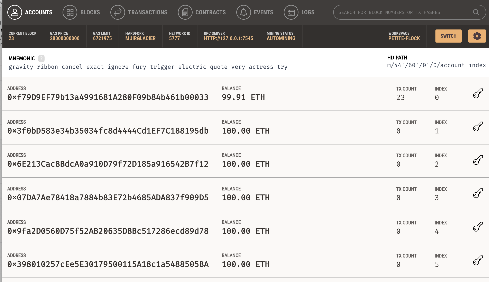
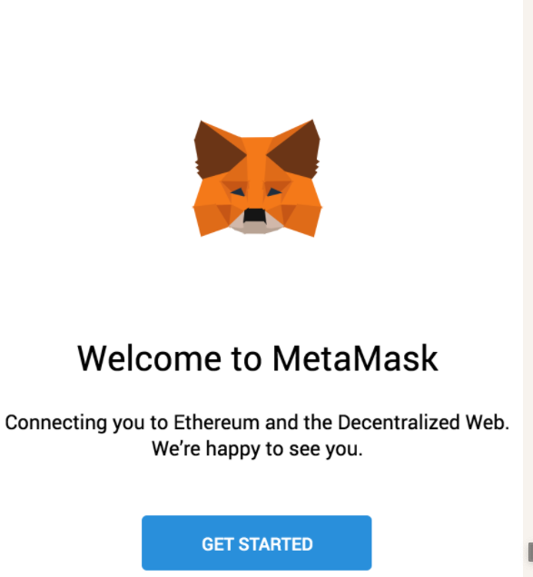
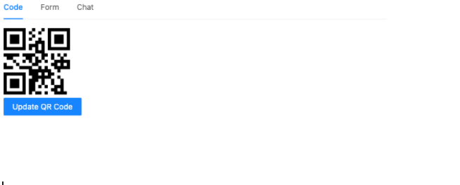
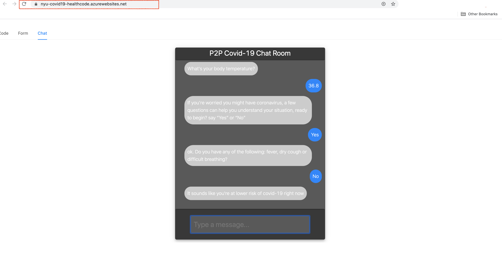

# Covid-19 HealthCode System

Our application, shortly speaking, is a system that people could track their health status associated with body temperature and the data is safely stored in a blockchain network. While as an important P2P feature, we added a COVID-19 chat room where people (or “peer node”) can exchange messages like asking questions about the common symptons of COVID-19. What’s more, in such the P2P network, there has another special node powered by the Amazon Lex that people could ask questions to an AI expert and even do self-checking of the COVID-19. Please follow later steps in this Github readme page for tring and testing it on your local machine.


## Getting Started

These instructions will get you a copy of the project up and running on your local machine for development and testing purposes. See deployment for notes on how to deploy the project on a live system.

### Prerequisites

- Node.js v8+ LTS and npm (comes with Node)

### Installing

A step by step series of examples that tell you how to get a development env running

Say what the step will be
We need to install Truffle:
```
npm install -g truffle
```
We also will be using Ganache, a personal blockchain for Ethereum development you can use to deploy contracts, develop applications, and run tests. You can download Ganache by navigating to http://truffleframework.com/ganache and clicking the "Download" button.


## Compiling and migrating the smart contract

### Compilation 
1. In a terminal, make sure you are in the root of the directory that contains the dapp and type:

    ```
       truffle compile
    ```

### Migration
Now that we've successfully compiled our contracts, it's time to migrate them to the blockchain!

1. we already have all migration file in the ```migrations/```directory
2. Before we can migrate our contract to the blockchain, we need to have a blockchain running. we're going to use Ganache, a personal blockchain for Ethereum development you can use to deploy contracts, develop applications, and run tests. 
  
3. migrate the contract to the blockchain

 ```
   truffle migrate
 ```

## Interacting with the dapp in a browser
Now we're ready to use our dapp!

### Installing and configuring MetaMask
The easiest way to interact with our dapp in a browser is through <mark>MetaMask</mark>, a browser extension for both Chrome and Firefox.

Install MetaMask in your browser.

Once installed, a tab in your browser should open displaying the following:


## Run the dapp
1. start the local web server:

    ```
       npm start
    ```
    The server will launch and automatically open a new browser tab containing your dapp.
    


​    

## Deployment

The client-side application can be deployed on the [Azure App Service](https://azure.microsoft.com/en-us/services/app-service/) (or other App PaaS services) and you can customize the domain name for remote accessing.

Here is one screenshot of our deployed application (https://nyu-covid19-healthcode.azurewebsites.net/). Notice that we may stop hosting the website later for it keeps charing the money.  



You can easily migrate it to the cloud and try the same way by sharing the link to your friend and chat in the p2p chatroom. If you have setup the Truffle/Ganache/Metamask envioronment, you can also test the blockchain part (healthcode) easily on your local machine (just like what we demoed above).

**Happy Hacking!**

